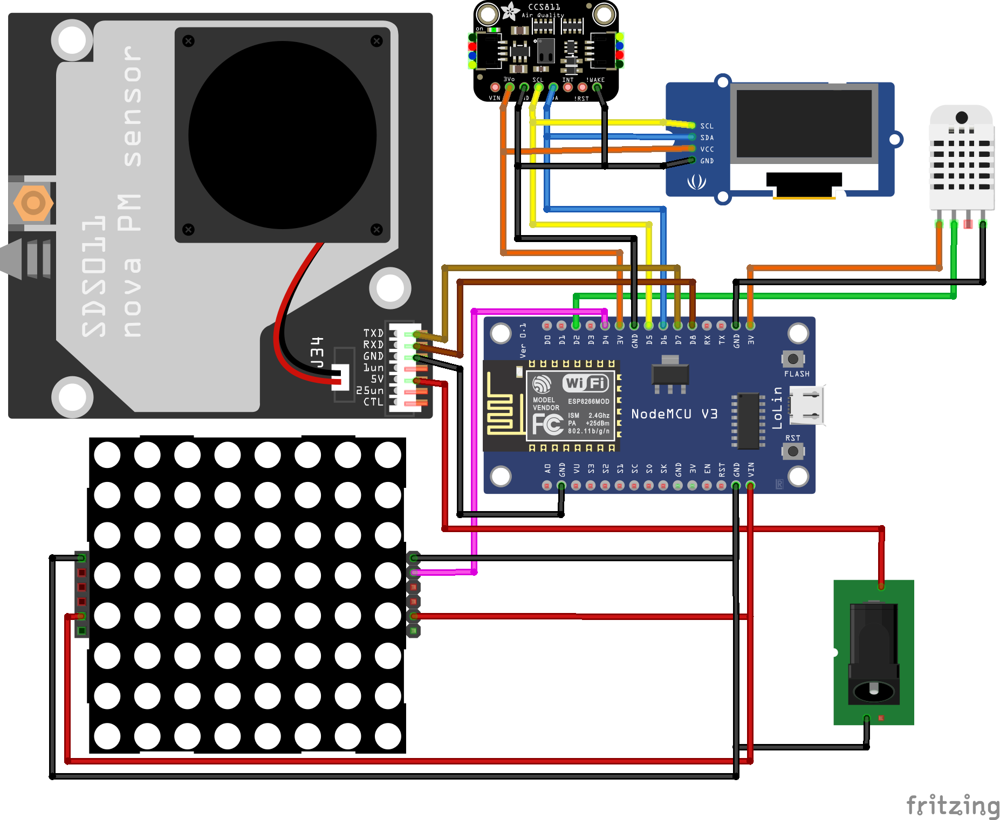

# AeVOC
Sensor measuring particles and aerosoles down to PM2.5 and VOCs and warn if concentrations get too high.

## About the project

AeVOC is an combined air quality sensor which helps to monitor aerosole concentrations and smelly organic compounds. You can use it to give warning if the air quality degrgades and it gets time to open the windows.

The sensor contains:
 * An SDS011 particle sensor, connected to a serial port. This sensor measures dust particles and aerosoles in the size categsries 10μm and 2,5μm. This measurement is the most important value to determine if the windows need to be opened. Aerosoles can contain viruses an bacteria and an infected person will exhale aerosoles with infections viruses, especially if speaking. If the values measured by the SDS011 rise it is time to exchange the air in the room.
 * An CCS811 VOC sensor, connected via i2c. This sensor detects volatile organic compounds which tend to be smelly and can be a health hazard in itself in very high concentrations. As VOCs are mostly emitted by humans the measured level help to detect degrading air quality and the need for fresh air.
 * An DHT22 (serial connetion with one wire) which reliably measures temperature and humidity.
 * All the sensors are driven by a NodeMCU with an ESP8266. Using this firmware the device publishes all its measurements via MQTT in addition to displaying them on a LED matrix and a small OLED.
 * The 0.96" OLED is connected via i2c. It displays all the measurements, a warning summary and for each measurement a small diagram.
 * A matrix of 8x8 WS2812-RGB-LEDs displays the most crucial measurements as a color coded diagram.
 
There are plans for a nice case made of wood. The document (viewable in the browser) contains technical drawings and the whole CAD design: https://cad.onshape.com/documents/d1397a8c60d8cf10bc632b52/w/d572a7dd96a755f54efafc1b/e/793fdbc24d1e0b242f0b46c7

There is also a step-by-step guide in german at Make Projects: https://makeprojects.com/de/project/aevoc

Watch the build on YouTube: https://youtu.be/r93HGVTbWig

A comprehensive description in german is published in c't 03/21.

## Interpreting the LEDs

The LED matrix displays 8 bar diagrams in its 8 columns. After 3 minutes of measuring all the columns get shifted to the right so the matrix gives an impression of the values in the last 21 to 24 minutes.

8 Pixels in the height of each column are no fine resolution so the sensor makes use of colors and brightness. At first the column shows a simple bar diagram using the 8 pixels. If more measurements come in it darkens the existing dtiagram and adds the new measurement in such a way that it never exceeds the maximum brightness for the filled bottom part of the columns. If the column gets faded out in the upper part the size of the fadeout gives an impression on the variance of the measured data.

The matrix uses 3 color channels to display two values. The blue channel displays the VOC levels. Particles and aerosoles are displayed with the red and green channel. If the newest leftmost measurement features high values the aerosole bar gets red. Middle values mix red and green to produce yellow bars, small values and bars light up in green. As the color channels are overlapping there may ba mixed colors. If VOCs and aerosoles are both in midrange the matrix displays white in the lower part because blue and yellow mix up to a cold white. 

The color for the aerosole amount is only determined for the most recent bar (up to 3 minutes). If there were red bars for high values in the past but the current value is low the matrix colors the high bars in green and the matrix glows bright and green.

The intuition behind all this is this:
 * If the sensor shows green the values are low.
 * High aerosole values generate a red warning color and the LEDs are brighter.
 * It the VOCs are high too the color gets more white but the bright LEDs indicate a warning.
 
## The Baseline of the CCS811

The VOC sensor calibrates its internal baseline on its own using the measurements it has seen. Do not expect to get accurate readings after powering the device up. Usually you should expose the sensor to fresh air without VOCs which usually makes it lower its baseline.

However the sensor semms to calibrate its baseline wrongly from time to time. A wrong baseline may produce values which are much too high (up to factor 100) which make the sensor show much blue. The baseline recalbrates automatically after some hours of use. We experienced the best measurements by just ignoring phases with a wrongly calibrated baseline and simply letting the sensor run. You can reset the baseline with a restart which usually leads to low but not yet calbrated values.

## Code structure

Please build the code using PlatformIO. The `platformio.ini` contains all the dependencies and specifies working upload speeds etc.
All the sources are in `src/`. The code is C++ so there are some classes with a definition in the header file and the implementation in the `.cpp` with the same name. Your starting point should be `main.cpp`.

In `configHelpers.h` you find maximum and minimum values which scale the diagrams. Please adjust these values if you get to know better maximim and minimum values for your region or because of new scientific insights which aerosol levels may be harmful. We tried to initialize these values with defaults which made sense in december 2020.
